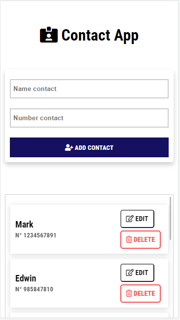
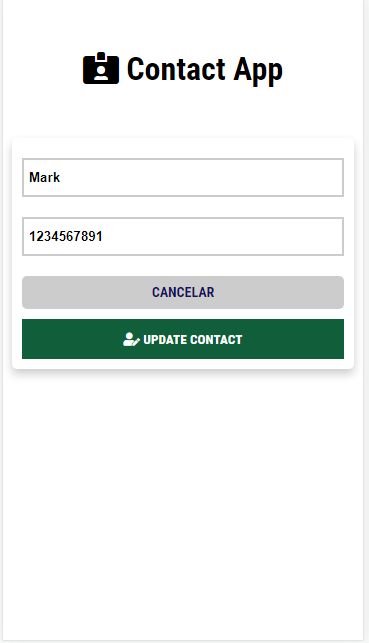
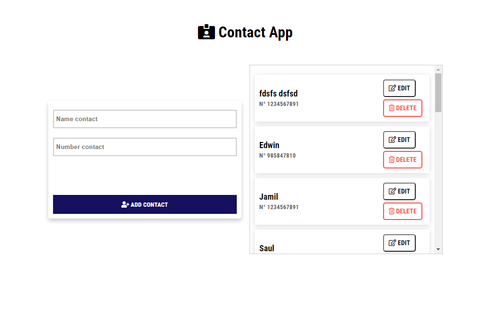
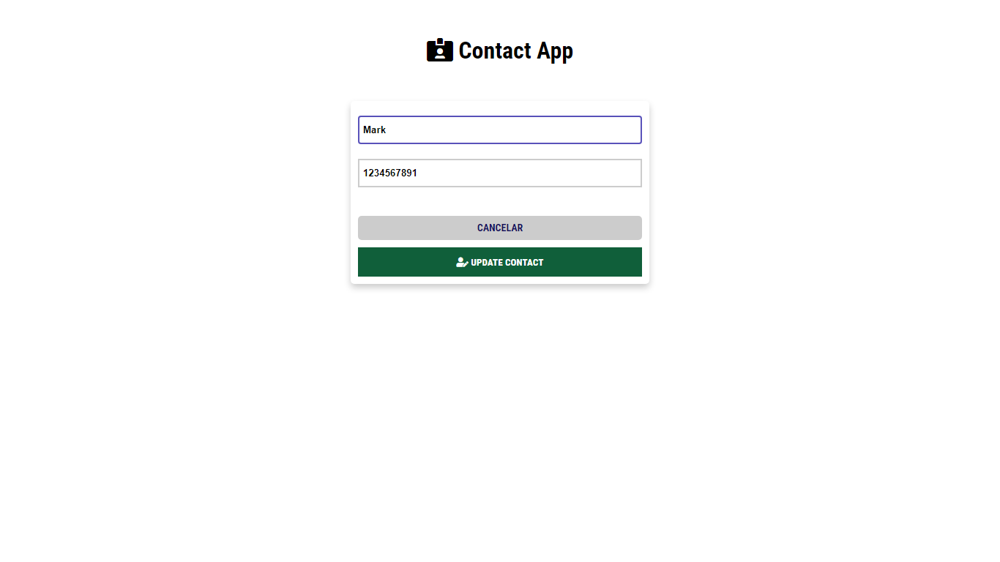
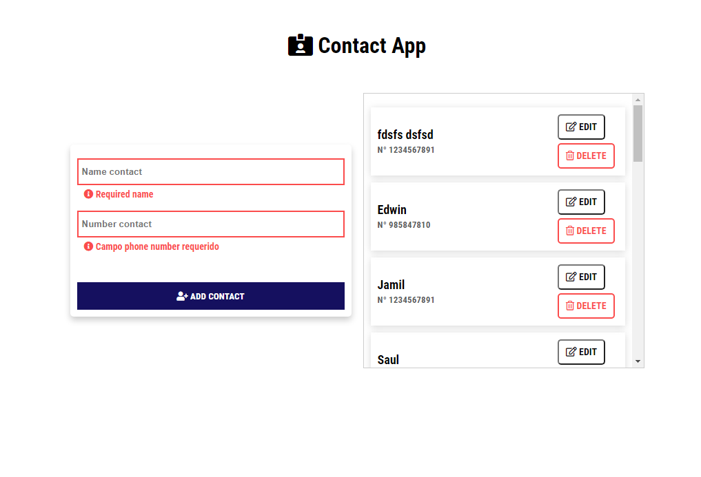
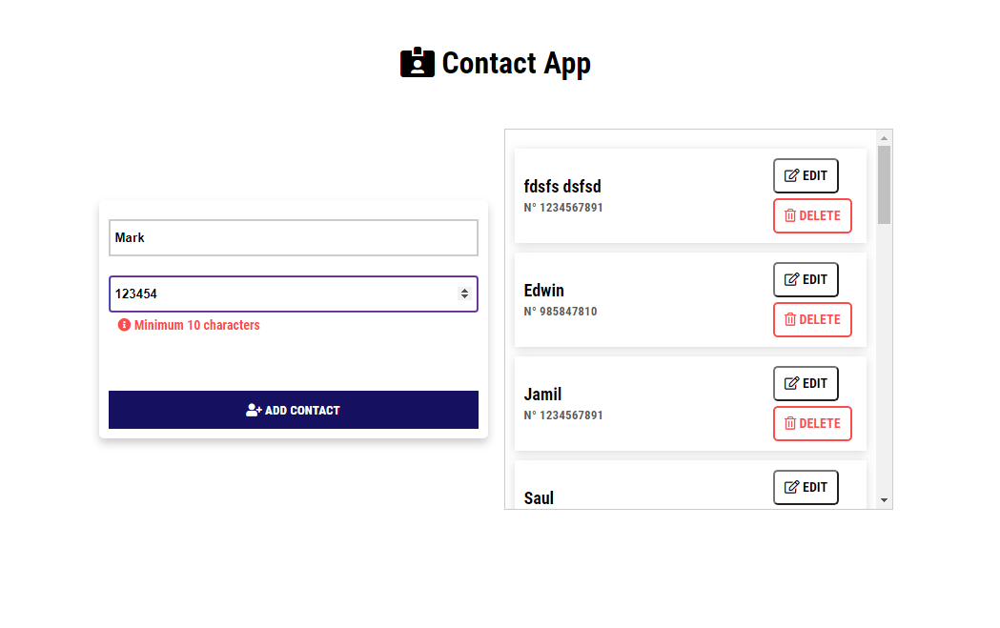

# Contact agenda app
This is a mini-project of practice with nodejs for the backend and mysql as SGBD.

## App design - Mobile
In the mobile view, this is how the form to create and edit contact is displayed.

### Create 

### Edit 

## App design - Desktop
In desktop view, this is how the form and its status changes are displayed.

### Create

### Edit

### Form state

